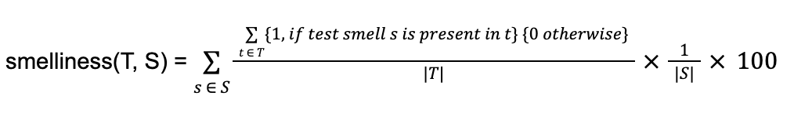

# Testing Bad Ice Cream

## About the game

Read the [Project.md](docs/Project.md) file to learn more about the game.

## Current Reports

- [Jacoco report](reports/jacoco/index.html)
- [PITest report](reports/pitest/index.html)

## Evaluation Formula

> 65% x branch coverage^ꭓ + 35% x mutation score^𝛼 - 10% x smelliness^ᵝ

**ꭓ**: As the project under test might have dead code or code impossible to reach/exercise, we will compute the maximum achievable branch coverage by

1. building a super-gigant test suite with all our test cases + all test cases developed by all students
2. running branch coverage. The branch coverage achieved by the super-gigant test suite will work as the maximum achievable branch coverage.

**𝛼**: As it is impossible to automatically detect whether a mutant is or is not equivalent, we will make an educated guess by

1. building a super-gigant test suite with all our test cases + all test cases developed by all students
2. running mutation analysis
3. identifying the mutants that are not killed by the super-gigant test suite. The non-killed mutants will be considered equivalent and will not be taken into account to assess the mutation score of your test suite.

**ᵝ**: To compute smelliness we first compute the ratio of test suites affected by each test smell and then the average % of test suites affected by all smells. Formally, given S as the set of smells and T as the set of test suites, smelliness is computed as:



## Final Results

- branch coverage = 95%
- mutation score = 95%
- smelliness = 4.910714285714286% ≈ 5%

## Commands

### Generate Jacoco report

```bash
mvn test jacoco:report
```
>target/site/jacoco/index.html

### Generate PITest report

```bash
mvn -DwithHistory test-compile org.pitest:pitest-maven:mutationCoverage
```
>target/pit-reports/index.html

### Generate smelliness report

Generate tsdetector-input-full.csv file
```bash
sudo ./generate-smelliness-report.sh
```

Remove all test suites files from tsdetector-input-full.csv where class under cover does not work in java <= 9.
Rename it to tsdetector-input.csv

```bash
java -jar TestSmellDetector.jar --file tsdetector-input.csv --thresholds spadini --granularity boolean --output tsdetector-output.csv
```
